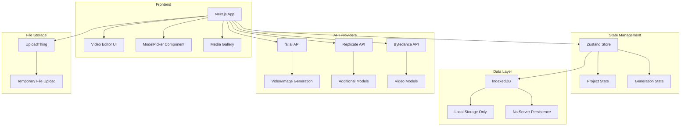
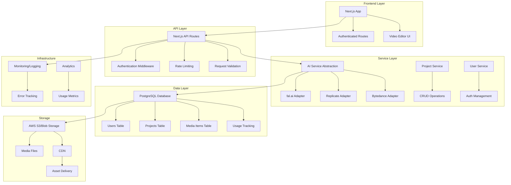

# Production Readiness Analysis: AI Video Studio

## Executive Summary

After thoroughly analyzing your fal.ai demo-based video generation application, I've identified significant architectural strengths alongside critical production readiness gaps. While the application demonstrates a solid foundation with modern tech stack choices, it requires substantial refactoring to support multi-user production workloads.

## Current Architecture Overview

## Critical Production Readiness Issues

### 1. Data Persistence & Storage Architecture 🚨

**Current State:**
- **IndexedDB only**: All project data stored locally in browser
- **No server-side persistence**: Projects lost when browser cache cleared
- **No user authentication**: Fake auth function in uploadthing/core.ts
- **No multi-user support**: Single-user design pattern throughout

**Impact:**
- Complete data loss on browser cache clear
- No collaboration capabilities
- Cannot scale beyond single device
- No backup or recovery mechanisms

### 2. Database Schema Limitations 🚨

**Current State:**
- Client-side only database operations
- No data relationships enforcement
- No migration system
- Limited query capabilities

**Missing Features:**
- User management tables
- Authentication system
- Project sharing/collaboration
- Usage analytics
- Billing integration

### 3. API Provider Integration Issues ⚠️

**Current State:**
- Inconsistent error handling across providers
- No retry mechanisms for failed requests
- Limited monitoring/logging
- Hardcoded API keys in environment

**Issues Found:**
- Duplicate model definitions across fal.ai and Bytedance
- No unified response format handling
- Missing rate limiting protection
- No cost tracking per project/user

### 4. Code Duplication & Technical Debt ⚠️

**Identified Duplications:**
1. **Video Generation Panels**: Two separate implementations
   - `src/components/video-generation/VideoGenerationPanel.tsx`
   - `src/components/ai/video-generation-panel.tsx`

2. **Model Definitions**: Overlapping across providers
   - Seedance models defined in both fal.ai and Bytedance configurations
   - Similar video generation parameters duplicated

3. **State Management**: Mixed patterns
   - Zustand for global state
   - React Query for server state
   - Local component state in some areas

### 5. Security Concerns 🚨

**Critical Issues:**
- No authentication/authorization system
- API keys exposed to client-side
- No input validation on server actions
- CORS and CSRF protections missing

## Production Readiness Assessment

| Category | Current State | Production Ready | Priority |
|----------|---------------|-------------------|----------|
| Authentication | ❌ None | ❌ | Critical |
| Data Persistence | ❌ Browser only | ❌ | Critical |
| Multi-user Support | ❌ Single user | ❌ | Critical |
| Error Handling | ⚠️ Basic | ⚠️ | High |
| Monitoring | ❌ None | ❌ | High |
| Testing | ⚠️ Basic mocks | ⚠️ | Medium |
| Documentation | ⚠️ README only | ⚠️ | Medium |
| Performance | ✅ Good | ✅ | Low |

## Recommended Architecture for Production

## Implementation Roadmap

### Phase 1: Critical Infrastructure (4-6 weeks)

1. **Implement Authentication System**
   - Add NextAuth.js or similar
   - Create user management tables
   - Implement API key management per user

2. **Server-Side Database**
   - Set up PostgreSQL database
   - Create migration system with Prisma/Drizzle
   - Implement CRUD APIs for projects/media

3. **Secure API Key Management**
   - Move API keys to server-side only
   - Implement per-user rate limiting
   - Add usage tracking

### Phase 2: Data Migration & Sync (2-3 weeks)

1. **Data Persistence Layer**
   - Create background sync from IndexedDB to server
   - Implement offline-first architecture
   - Add conflict resolution

2. **File Storage**
   - Implement proper file storage (S3/Blob)
   - Create CDN integration
   - Add file processing pipeline

### Phase 3: Code Quality & Performance (2-3 weeks)

1. **Refactor Duplicate Code**
   - Unified video generation component
   - Consolidate model definitions
   - Standardize API response handling

2. **Testing & Quality**
   - Add comprehensive test suite
   - Implement E2E testing
   - Add performance monitoring

### Phase 4: Production Features (3-4 weeks)

1. **Collaboration Features**
   - Project sharing
   - Real-time collaboration
   - Version control for projects

2. **Monitoring & Analytics**
   - Error tracking (Sentry)
   - Performance monitoring
   - Usage analytics

## Cost Estimates

| Component | Monthly Estimate (100 users) | Notes |
|-----------|-----------------------------|-------|
| Database | $50-100 | PostgreSQL with backups |
| Storage | $100-200 | S3/Blob storage for media |
| CDN | $50-100 | Asset delivery |
| AI APIs | $500-2000+ | Depends on usage |
| Monitoring | $50-100 | Error tracking/analytics |
| **Total** | **$750-2500+** | Excluding development costs |

## Immediate Action Items

1. **Stop production deployment** until authentication is implemented
2. **Implement proper backup** of existing IndexedDB data
3. **Create development environment** with proper database
4. **Audit all API keys** and move to server-side
5. **Implement basic authentication** as first priority

## Conclusion

Your application has excellent potential with a solid foundation, but it's currently not production-ready for multi-user scenarios. The primary blockers are the lack of authentication and server-side data persistence. With the recommended roadmap, you can transform this into a robust, scalable production application in approximately 3-4 months.

The good news is that your frontend architecture, component structure, and AI service integrations are well-designed and will require minimal changes during the migration.